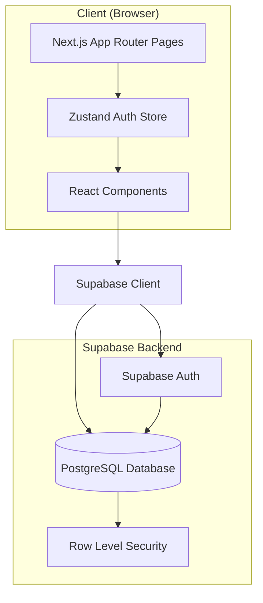
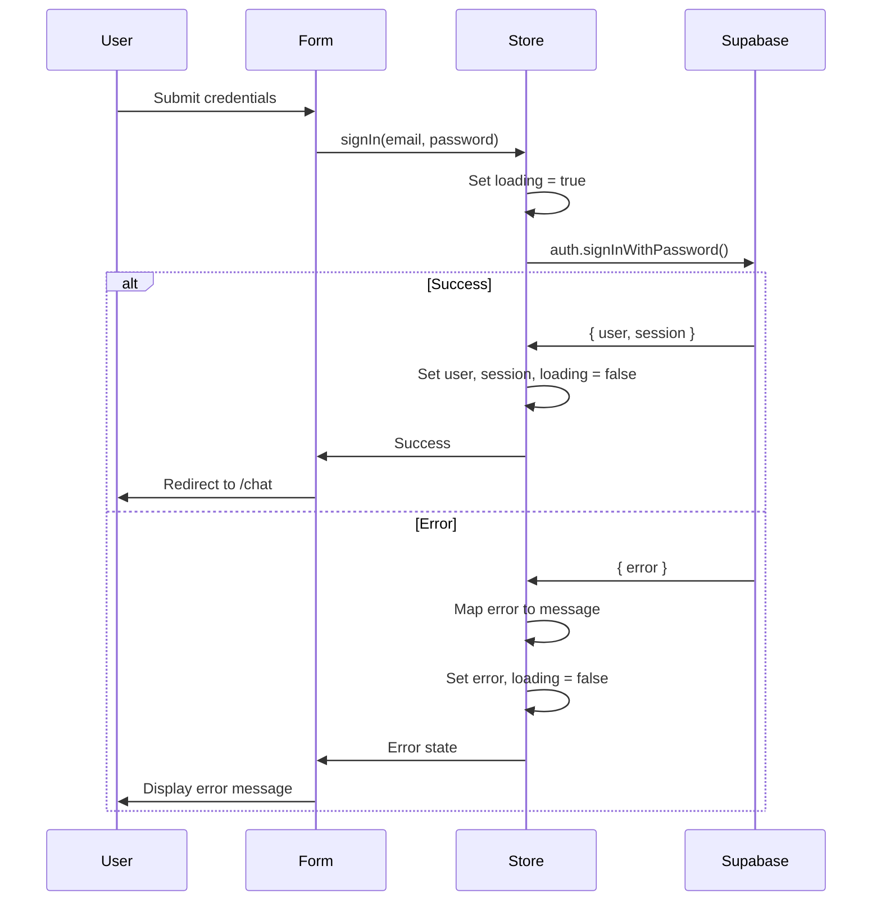

# Design Document

## Overview

LexiPH is a Next.js 14 application using the App Router architecture with TypeScript. The system implements a ChatGPT-inspired interface for Philippine legal compliance assistance. The MVP focuses on authentication infrastructure and UI foundation, leveraging Supabase for backend services, Zustand for client-side state management, and shadcn/ui with Tailwind CSS for the interface.

The architecture follows a client-side rendering approach with server-side session validation, ensuring secure authentication flows and optimal user experience.

## Architecture

### High-Level Architecture



### Technology Stack

- **Frontend Framework**: Next.js 14 with App Router and TypeScript
- **Authentication**: Supabase Auth (email/password)
- **Database**: Supabase PostgreSQL with Row Level Security
- **State Management**: Zustand (lightweight, hook-based)
- **UI Framework**: Tailwind CSS + shadcn/ui components
- **Icons**: Lucide React
- **Deployment**: Vercel (recommended for Next.js)

### Folder Structure

```
lexiph/
├── app/
│   ├── layout.tsx                 # Root layout with session check
│   ├── page.tsx                   # Landing page
│   ├── auth/
│   │   ├── login/page.tsx         # Login page
│   │   └── signup/page.tsx        # Signup page
│   └── chat/page.tsx              # Protected chat interface
├── components/
│   ├── auth/
│   │   ├── login-form.tsx         # Login form component
│   │   └── signup-form.tsx        # Signup form component
│   ├── layout/
│   │   ├── chat-header.tsx        # Header with logo and user menu
│   │   └── user-menu.tsx          # Avatar dropdown menu
│   └── chat/
│       ├── chat-container.tsx     # Main chat layout wrapper
│       ├── chat-messages.tsx      # Messages list with scroll
│       ├── chat-input.tsx         # Message input with send button
│       └── message-bubble.tsx     # Individual message display
├── lib/
│   ├── supabase/
│   │   └── client.ts              # Supabase client initialization
│   └── store/
│       └── auth-store.ts          # Zustand authentication store
├── types/
│   └── index.ts                   # TypeScript type definitions
└── .env.local                     # Environment variables
```

## Components and Interfaces

### 1. Supabase Client (`lib/supabase/client.ts`)

**Purpose**: Initialize and export Supabase client for authentication and database operations.

**Implementation**:
```typescript
import { createClient } from '@supabase/supabase-js'

const supabaseUrl = process.env.NEXT_PUBLIC_SUPABASE_URL!
const supabaseAnonKey = process.env.NEXT_PUBLIC_SUPABASE_ANON_KEY!

export const supabase = createClient(supabaseUrl, supabaseAnonKey)
```

**Environment Variables Required**:
- `NEXT_PUBLIC_SUPABASE_URL`: Supabase project URL
- `NEXT_PUBLIC_SUPABASE_ANON_KEY`: Supabase anonymous key

### 2. Auth Store (`lib/store/auth-store.ts`)

**Purpose**: Centralized state management for authentication using Zustand.

**State Shape**:
```typescript
interface AuthState {
  user: User | null
  session: Session | null
  loading: boolean
  error: string | null
  
  signIn: (email: string, password: string) => Promise<void>
  signUp: (email: string, password: string) => Promise<void>
  signOut: () => Promise<void>
  checkSession: () => Promise<void>
  clearError: () => void
}
```

**Key Methods**:
- `signIn`: Authenticates user with Supabase, updates state, handles errors
- `signUp`: Creates new user account, auto-authenticates, handles validation errors
- `signOut`: Terminates session, clears state, redirects to login
- `checkSession`: Retrieves current session on app load, populates user state
- `clearError`: Resets error state for form re-submission

**Error Handling Strategy**:
- Catch Supabase errors and map to user-friendly messages
- Set loading states during async operations
- Clear errors on successful operations

### 3. Authentication Components

#### LoginForm (`components/auth/login-form.tsx`)

**Props**: None (uses router for navigation)

**State**:
- `email`: string
- `password`: string
- Local loading state (derived from store)

**Behavior**:
- Validates email format and password presence
- Calls `authStore.signIn()` on submit
- Displays error from store if present
- Disables inputs during loading
- Links to signup page
- Redirects to `/chat` on success

**UI Elements**:
- Email input (type="email", required)
- Password input (type="password", required)
- Submit button with loading spinner
- Error message display (red text)
- "Don't have an account? Sign up" link

#### SignupForm (`components/auth/signup-form.tsx`)

**Props**: None

**State**:
- `email`: string
- `password`: string
- `confirmPassword`: string
- `passwordError`: string (client-side validation)

**Behavior**:
- Validates email format
- Validates password length (min 6 characters)
- Validates passwords match before submission
- Calls `authStore.signUp()` on submit
- Auto-redirects to `/chat` on success
- Links to login page

**Validation Rules**:
- Email: Must be valid email format
- Password: Minimum 6 characters
- Confirm Password: Must match password field
- Display validation errors inline

### 4. Layout Components

#### ChatHeader (`components/layout/chat-header.tsx`)

**Props**: None (reads user from auth store)

**Structure**:
```
┌─────────────────────────────────────┐
│ LexiPH              [User Avatar ▼] │
└─────────────────────────────────────┘
```

**Styling**:
- Fixed height (h-16)
- White background with bottom border
- Sticky positioning (sticky top-0)
- Flex layout with space-between
- Logo: text-xl font-bold
- Z-index for layering above content

**Integration**:
- Embeds UserMenu component
- Reads user data from auth store

#### UserMenu (`components/layout/user-menu.tsx`)

**Props**: None

**Structure**:
- Avatar button (circular, bg-blue-500, white text)
- Dropdown menu (shadcn DropdownMenu)
  - User email (gray, small text)
  - Divider
  - Sign Out button (red text on hover)

**Avatar Logic**:
- If `user.avatar_url` exists: Display image
- Else: Display first letter of email in uppercase

**Dropdown Actions**:
- Sign Out: Calls `authStore.signOut()`

### 5. Chat Components

#### ChatContainer (`components/chat/chat-container.tsx`)

**Props**: None

**Layout Structure**:
```
┌─────────────────────┐
│   ChatHeader        │ ← Sticky
├─────────────────────┤
│                     │
│   ChatMessages      │ ← Scrollable, flex-1
│                     │
├─────────────────────┤
│   ChatInput         │ ← Fixed bottom
└─────────────────────┘
```

**Styling**:
- Full viewport height (h-screen)
- Flex column layout
- Background: bg-slate-50
- Max width: max-w-3xl mx-auto

#### ChatMessages (`components/chat/chat-messages.tsx`)

**Props**:
```typescript
interface ChatMessagesProps {
  messages: Message[]
}
```

**State**:
- `messagesEndRef`: Ref for auto-scroll

**Behavior**:
- Maps through messages array
- Renders MessageBubble for each message
- Auto-scrolls to bottom on new message (useEffect)
- Shows empty state when messages.length === 0

**Empty State**:
- Centered text: "Start a conversation..."
- Gray color, large text

**Scroll Behavior**:
- Uses `scrollIntoView({ behavior: 'smooth' })` on messagesEndRef
- Triggers on messages array change

#### MessageBubble (`components/chat/message-bubble.tsx`)

**Props**:
```typescript
interface MessageBubbleProps {
  message: Message
}
```

**Conditional Styling**:

**User Messages**:
- Background: bg-blue-500
- Text: text-white
- Alignment: ml-auto (right-aligned)
- Max width: max-w-[80%]

**AI Messages**:
- Background: bg-white
- Border: border border-slate-200
- Text: text-slate-900
- Alignment: mr-auto (left-aligned)
- Max width: max-w-[80%]

**Common Styling**:
- Rounded corners: rounded-lg
- Padding: p-4
- Margin: mb-4
- Shadow: shadow-sm

**Timestamp**:
- Format: "HH:MM AM/PM"
- Style: text-xs text-slate-400 mt-1
- Position: Below message content

#### ChatInput (`components/chat/chat-input.tsx`)

**Props**: None (for MVP, no actual sending)

**State**:
- `message`: string
- `isSending`: boolean (simulated for MVP)

**Structure**:
```
┌─────────────────────────────────┐
│ [Textarea...            ] [→]   │
└─────────────────────────────────┘
```

**Behavior**:
- Textarea with placeholder
- Send button with arrow icon (Lucide `Send` icon)
- Disable both during sending
- Clear textarea after send (MVP: just clear, no actual API call)

**Styling**:
- Container: border rounded-lg p-4 bg-white
- Textarea: resize-none, focus:outline-none
- Send button: bg-blue-500 text-white rounded-lg p-2 hover:bg-blue-600

## Data Models

### TypeScript Types (`types/index.ts`)

```typescript
export interface User {
  id: string
  email: string
  full_name?: string
  avatar_url?: string
}

export interface Message {
  id: string
  role: 'user' | 'assistant'
  content: string
  created_at: string
}

export interface AuthError {
  message: string
  status?: number
}
```

### Supabase Database Schema

#### profiles Table

```sql
CREATE TABLE profiles (
  id UUID REFERENCES auth.users(id) PRIMARY KEY,
  email TEXT NOT NULL,
  full_name TEXT,
  avatar_url TEXT,
  created_at TIMESTAMP WITH TIME ZONE DEFAULT NOW(),
  updated_at TIMESTAMP WITH TIME ZONE DEFAULT NOW()
);
```

**Row Level Security Policies**:

```sql
-- Enable RLS
ALTER TABLE profiles ENABLE ROW LEVEL SECURITY;

-- Users can view their own profile
CREATE POLICY "Users can view own profile"
  ON profiles FOR SELECT
  USING (auth.uid() = id);

-- Users can update their own profile
CREATE POLICY "Users can update own profile"
  ON profiles FOR UPDATE
  USING (auth.uid() = id);
```

**Trigger for Auto-Profile Creation**:

```sql
CREATE OR REPLACE FUNCTION public.handle_new_user()
RETURNS TRIGGER AS $$
BEGIN
  INSERT INTO public.profiles (id, email)
  VALUES (NEW.id, NEW.email);
  RETURN NEW;
END;
$$ LANGUAGE plpgsql SECURITY DEFINER;

CREATE TRIGGER on_auth_user_created
  AFTER INSERT ON auth.users
  FOR EACH ROW EXECUTE FUNCTION public.handle_new_user();
```

## Error Handling

### Error Categories and Messages

| Error Type | Supabase Error | User-Facing Message |
|------------|----------------|---------------------|
| Invalid Credentials | `Invalid login credentials` | "Invalid email or password" |
| Email Exists | `User already registered` | "Email already exists" |
| Weak Password | `Password should be at least 6 characters` | "Password must be at least 6 characters" |
| Network Error | `fetch failed` | "Connection failed. Please try again." |
| Generic Error | Any other | "An error occurred. Please try again." |

### Error Display Strategy

1. **Form-Level Errors**: Display above submit button in red text with alert icon
2. **Field-Level Errors**: Display below specific input field (e.g., password mismatch)
3. **Toast Notifications**: Not used in MVP (keep it simple)
4. **Error Clearing**: Clear errors on new form submission or successful action

### Error Handling Flow



## Testing Strategy

### MVP Testing Approach

Since this is an MVP focused on authentication and UI, testing will be manual with a structured checklist. Automated tests are deferred to post-MVP.

### Manual Testing Checklist

**Authentication Flow**:
1. ✓ Navigate to `/auth/signup`
2. ✓ Enter email and password (matching)
3. ✓ Submit form - should create account and redirect to `/chat`
4. ✓ Log out from user menu
5. ✓ Navigate to `/auth/login`
6. ✓ Enter same credentials
7. ✓ Submit form - should authenticate and redirect to `/chat`
8. ✓ Refresh page - should remain authenticated
9. ✓ Open new tab, navigate to `/chat` - should be authenticated
10. ✓ Log out - should redirect to `/auth/login`

**Error Handling**:
1. ✓ Try to sign up with existing email - should show "Email already exists"
2. ✓ Try to sign up with password < 6 chars - should show error
3. ✓ Try to sign up with mismatched passwords - should show error
4. ✓ Try to log in with wrong password - should show "Invalid email or password"
5. ✓ Try to log in with non-existent email - should show error

**Route Protection**:
1. ✓ While logged out, navigate to `/chat` - should redirect to `/auth/login`
2. ✓ While logged in, navigate to `/auth/login` - should redirect to `/chat`
3. ✓ While logged in, navigate to `/auth/signup` - should redirect to `/chat`

**UI/UX**:
1. ✓ Chat interface resembles ChatGPT (clean, centered, white)
2. ✓ Header shows LexiPH logo and user avatar
3. ✓ User menu dropdown works correctly
4. ✓ Mock message displays correctly (AI message bubble)
5. ✓ Input area is fixed at bottom
6. ✓ Responsive on mobile (test with DevTools)

**Session Persistence**:
1. ✓ Log in, close browser, reopen - should remain logged in
2. ✓ Log in, refresh page multiple times - should remain logged in
3. ✓ Log out, refresh page - should remain logged out

### Future Testing Considerations

Post-MVP, implement:
- **Unit Tests**: Zustand store actions, utility functions
- **Integration Tests**: Authentication flows with Supabase
- **E2E Tests**: Full user journeys with Playwright or Cypress
- **Component Tests**: React Testing Library for UI components

## Implementation Notes

### Next.js App Router Patterns

**Server vs Client Components**:
- Pages: Server components by default
- Forms and interactive components: Client components (`'use client'`)
- Auth store: Client-side only (uses hooks)

**Middleware for Route Protection** (Optional Enhancement):
```typescript
// middleware.ts
import { createMiddlewareClient } from '@supabase/auth-helpers-nextjs'
import { NextResponse } from 'next/server'
import type { NextRequest } from 'next/server'

export async function middleware(req: NextRequest) {
  const res = NextResponse.next()
  const supabase = createMiddlewareClient({ req, res })
  const { data: { session } } = await supabase.auth.getSession()
  
  // Protect /chat route
  if (req.nextUrl.pathname.startsWith('/chat') && !session) {
    return NextResponse.redirect(new URL('/auth/login', req.url))
  }
  
  return res
}
```

**For MVP**: Use client-side route protection with useEffect in pages.

### Supabase Setup Steps

1. Create Supabase project at https://supabase.com
2. Copy project URL and anon key to `.env.local`
3. Run SQL commands in Supabase SQL Editor:
   - Create profiles table
   - Enable RLS policies
   - Create trigger for auto-profile creation
4. Test authentication in Supabase dashboard

### Styling Conventions

**Tailwind Utility Patterns**:
- Spacing: `p-4`, `p-6`, `p-8`, `space-y-4`, `gap-4`
- Colors: `bg-slate-50`, `bg-blue-500`, `text-white`, `border-slate-200`
- Borders: `border`, `rounded-lg`, `rounded-full`
- Shadows: `shadow-sm`, `shadow-md`
- Hover: `hover:bg-slate-100`, `hover:bg-blue-600`
- Transitions: `transition-colors`

**shadcn/ui Components Used**:
- DropdownMenu (for user menu)
- Button (optional, can use plain Tailwind)
- Input (optional, can use plain Tailwind)

### Performance Considerations

- **Code Splitting**: Next.js automatically splits by route
- **Image Optimization**: Use Next.js `<Image>` for avatars (future enhancement)
- **Bundle Size**: Zustand is lightweight (~1KB), Supabase client is tree-shakeable
- **Lazy Loading**: Not needed for MVP (small component count)

### Security Considerations

- **Environment Variables**: Never commit `.env.local`, use `.env.example` template
- **RLS Policies**: Enforce at database level, not just client-side
- **HTTPS**: Required for Supabase (enforced by default)
- **Password Requirements**: Minimum 6 characters (Supabase default)
- **Session Storage**: Supabase uses secure httpOnly cookies

### Deployment Checklist

1. Set environment variables in Vercel
2. Ensure Supabase project is in production mode
3. Test authentication flow in production
4. Verify RLS policies are active
5. Check CORS settings if needed (Supabase allows all by default)

## MVP Limitations and Future Enhancements

**MVP Scope** (What's Included):
- ✓ Email/password authentication
- ✓ Session persistence
- ✓ Route protection
- ✓ ChatGPT-style UI
- ✓ User profile storage
- ✓ Mock chat interface

**Post-MVP Enhancements**:
- AI chat integration (OpenAI API or similar)
- Chat history persistence
- Message streaming
- Profile editing (name, avatar upload)
- Password reset flow
- Social authentication (Google, Facebook)
- Dark mode
- Mobile app (React Native)
- Admin dashboard
- Usage analytics

**Known Limitations**:
- No actual AI responses (mock data only)
- No chat history storage
- No message persistence
- No real-time updates
- No file attachments
- No message editing/deletion
